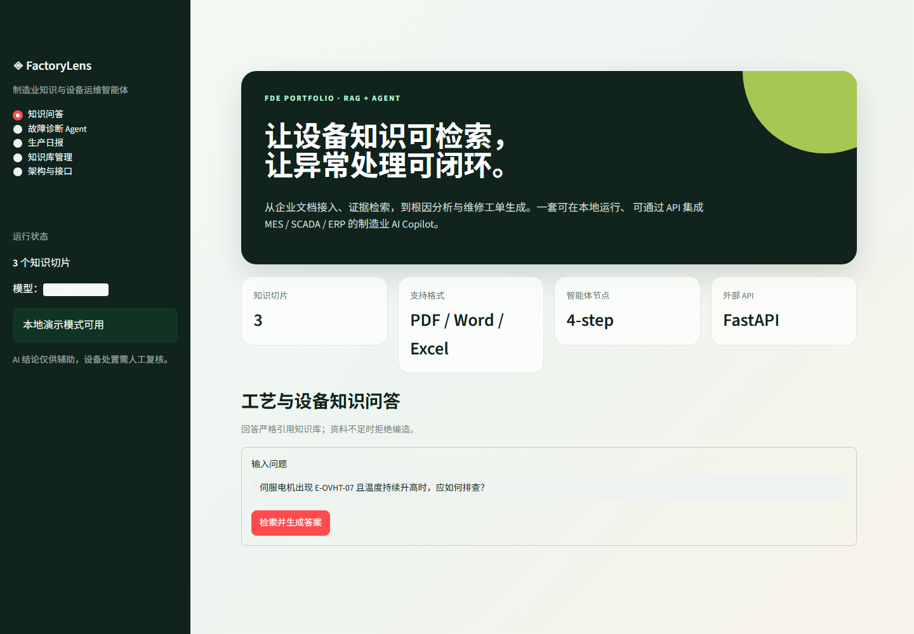
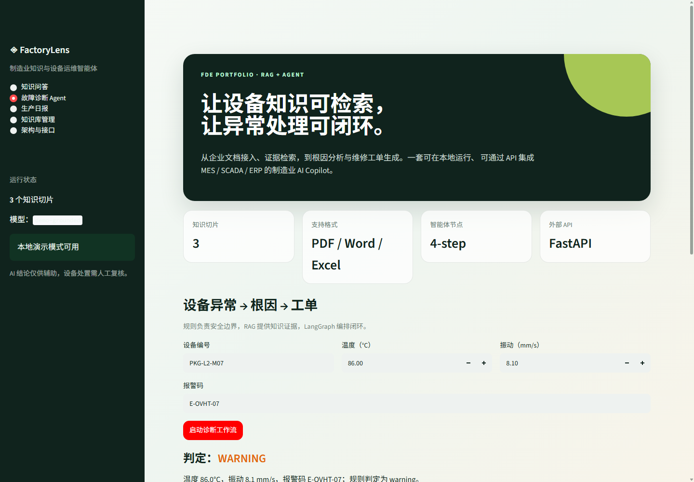
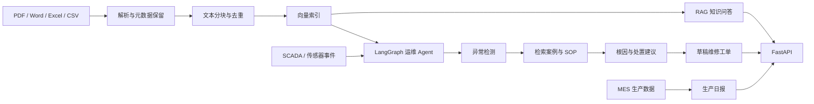

# FactoryLens Semantic RAG Agent｜制造业语义知识与运维智能体

> 面向制造业现场的真实语义检索、企业知识问答与设备运维智能体。
> 支持离线演示、OpenAI、Ollama 与本地 BGE Embedding，可完整观察从文档切片到答案生成的 RAG 链路。




## 项目要解决什么问题

制造企业的设备手册、SOP 和历史故障案例通常散落在 PDF、Word、Excel 和员工经验中。
出现故障时，现场人员需要跨文档搜索、向老师傅询问，再手工填写工单，处理效率和知识传承
都很不稳定。

FactoryLens 将这段流程做成一套可演示闭环：

```text
企业文档接入
    ↓
解析、分块、向量化、去重
    ↓
带引用的专业知识问答
    ↓
传感器异常 → 根因分析 → 维修建议 → 草稿工单
    ↓
FastAPI 对接 MES / SCADA / ERP
```

它不是一个只有聊天框的 Demo，而是包含数据接入、检索、Agent 工作流、API、评测和安全边界
的最小完整系统。

## 核心功能

- **多格式知识接入**：PDF、Word、Excel、CSV、Markdown 和 TXT。
- **真实语义 RAG**：可切换 OpenAI、Ollama 或本地 BGE Embedding；离线模式保留零依赖 Hashing 检索。
- **透明检索链路**：界面展示 Top-K、相似度、切片 ID、来源位置和进入 Prompt 的完整上下文。
- **可追溯回答**：回答附带文档名、页码/工作表和检索得分；无依据时拒绝编造。
- **设备运维 Agent**：LangGraph 编排“异常检测 → 知识检索 → 根因分析 → 工单生成”。
- **生产日报**：读取模拟 MES 数据，计算计划达成率、停机和报警，自动给出风险与动作。
- **企业集成接口**：FastAPI 提供 `/ask`、`/diagnose`、`/reports/production` 等接口。
- **离线演示模式**：没有 API Key 也能完整展示；可切换 OpenAI 兼容接口或本地 Ollama。
- **测试与评测**：包含解析、检索、工作流、日报单元测试，以及小型 RAG 检索评测集。

## 演示场景

项目内置完全虚构、可安全公开的样例资料：

1. 包装线伺服电机出现 `E-OVHT-07`；
2. 温度为 86°C，振动为 8.1 mm/s；
3. 系统检索设备手册、异常 SOP 和历史故障案例；
4. 给出疑似根因和安全处置建议；
5. 生成一张 `draft` 状态的维修工单，等待工程师审批。



> 安全设计：规则负责越限判断和 LOTO 提醒，LLM 只负责依据知识库组织信息。AI 不会自动
> 下发维修动作，工单必须经设备工程师复核。

## 系统架构



### 为什么这样设计

- **确定性规则和生成模型分工**：安全阈值不用 LLM 猜，专业解释必须有文档证据。
- **工作流而非“万能 Agent”**：设备处置路径固定、可审计，更适合企业场景。
- **适配层而非伪造真实连接**：作品使用 CSV/JSON 模拟 MES/SCADA；真实项目只需替换接入层。
- **默认离线可运行**：面试演示不依赖外部网络和付费 Key。

## 快速开始（Windows）

要求：Python 3.11+。

```powershell
git clone <你的仓库地址>
cd FactoryLens-Semantic-RAG-Agent
.\start.ps1
```

首次启动会创建虚拟环境、安装依赖并初始化样例知识库。浏览器打开：

```text
http://localhost:8501
```

### 手动启动

```powershell
python -m venv .venv
.\.venv\Scripts\Activate.ps1
pip install -e ".[models,dev]"
python scripts/bootstrap.py
streamlit run app.py
```

### 启动 API

另开一个 PowerShell：

```powershell
.\start-api.ps1
```

Swagger 文档：

```text
http://127.0.0.1:8000/docs
```

## 模型与向量配置

复制环境变量模板：

```powershell
Copy-Item .env.example .env
```

### 1. 无 Key 演示（默认）

```env
LLM_PROVIDER=demo
EMBEDDING_PROVIDER=demo
```

该模式使用本地字符 Hashing 向量执行确定性检索，并用模板组织带引用答案，适合无网络演示和自动化测试。

### 2. OpenAI 兼容接口

```env
LLM_PROVIDER=openai
EMBEDDING_PROVIDER=openai
OPENAI_API_KEY=your-key
OPENAI_BASE_URL=https://api.openai.com/v1
OPENAI_MODEL=gpt-4.1-mini
OPENAI_EMBEDDING_MODEL=text-embedding-3-small
```

生成与 Embedding 可以分别配置；`OPENAI_BASE_URL` 可替换为其他兼容服务地址。

### 3. 本地 Ollama

```env
LLM_PROVIDER=ollama
EMBEDDING_PROVIDER=ollama
OLLAMA_BASE_URL=http://localhost:11434
OLLAMA_MODEL=qwen2.5:7b
OLLAMA_EMBEDDING_MODEL=bge-m3
```

### 4. 本地 BGE 语义向量

先安装可选依赖：

```powershell
pip install -e ".[semantic]"
```

再配置：

```env
LLM_PROVIDER=demo
EMBEDDING_PROVIDER=bge
BGE_EMBEDDING_MODEL=BAAI/bge-small-zh-v1.5
```

首次运行会下载模型；之后可在本地完成中文语义检索。也可以将 `LLM_PROVIDER` 改为 `openai` 或 `ollama`，实现真实语义检索与大模型生成的组合。

## API 示例

### 知识问答

```bash
curl -X POST http://127.0.0.1:8000/ask \
  -H "Content-Type: application/json" \
  -d "{\"question\":\"E-OVHT-07 应如何排查？\",\"top_k\":4}"
```

### 设备诊断

```bash
curl -X POST http://127.0.0.1:8000/diagnose \
  -H "Content-Type: application/json" \
  -d "{\"asset_id\":\"PKG-L2-M07\",\"temperature_c\":86,\"vibration_mm_s\":8.1,\"error_code\":\"E-OVHT-07\"}"
```

## 文档接入管道

解析器会保留可用于引用的元数据：

| 格式 | 解析内容 | 保留元数据 |
|---|---|---|
| PDF | 每页文本 | 文件名、页码 |
| Word | 段落与表格 | 文件名 |
| Excel | 每个工作表 | 文件名、工作表 |
| CSV | 结构化表格 | 文件名 |
| Markdown/TXT | 纯文本 | 文件名 |

上传文档后执行：

```text
解析 → 清洗 → 递归分块 → 内容哈希去重 → 向量化 → 持久化
```

向量层采用统一接口：离线模式使用字符级 Hashing 向量，真实语义模式可选择 OpenAI、BGE 或 Ollama Embeddings。不同模型使用独立索引文件，切换模型不会复用维度不兼容的旧向量。

## 测试与 RAG 评测

```powershell
pytest -q
factorylens-eval
```

评测输出：

- `retrieval_hit_rate`：预期来源是否出现在 Top-K；
- `term_coverage`：关键答案词是否被检索证据覆盖；
- 每个问题的明细结果。

## 目录结构

```text
FactoryLens-Semantic-RAG-Agent/
├─ app.py                         # Streamlit 演示界面
├─ src/factorylens/
│  ├─ ingestion.py               # PDF/Word/Excel 文档管道
│  ├─ vector_store.py             # 本地向量索引
│  ├─ rag.py / llm.py             # 检索增强生成
│  ├─ workflow.py                 # LangGraph 设备运维 Agent
│  ├─ reporting.py                # 生产日报
│  ├─ api.py                      # FastAPI 企业接口
│  └─ evaluation.py               # RAG 评测
├─ knowledge_base/                # 虚构样例知识库
├─ data/                          # 模拟 MES 数据
├─ eval/                          # 评测集
├─ tests/                         # 自动化测试
└─ scripts/                       # 初始化与样例生成
```

## 我在这个项目中完成了什么

- 将设备手册、SOP 和故障案例统一成可检索文档对象；
- 设计可离线运行的向量检索和来源引用机制；
- 用 LangGraph 编排可审计的设备运维工作流；
- 将诊断结果转成结构化、可下载、可持久化的工单；
- 为知识问答、诊断和生产日报提供 FastAPI；
- 编写样例数据、测试、检索评测和中文使用文档。

## 生产化还需要补什么

这是作品集项目，不宣称已经在真实工厂上线。若进入生产环境，下一步包括：

- 使用企业 SSO、角色权限、文档 ACL 和审计日志；
- 通过 OPC UA、MQTT 或厂商 API 接入真实 SCADA/MES；
- 引入文档版本管理、增量索引和删除同步；
- 使用更强的中文 Embeddings 与 reranker；
- 建立人工审批、工单回写、失败重试和监控告警；
- 用真实专家标注集评估召回率、忠实度和故障建议安全性。

## 许可

本项目采用 [PolyForm Noncommercial 1.0.0](LICENSE) 公开源码，仅允许个人学习、研究、实验及其他非商业用途；**不允许商业使用**。复制、修改或分发时必须同时保留许可证及 [NOTICE](NOTICE) 中以 `Required Notice:` 开头的署名信息。商业授权需另行取得作者书面许可。
